# winstats

System resource widgets in the style of [exelban/stats](https://github.com/exelban/stats), embedded directly into the
Windows taskbar: the strip becomes a child of `Shell_TrayWnd` and is drawn with per-pixel alpha, so the taskbar
background (including a translucent one) is left untouched.

## Screenshots

The strip next to the system tray (per-core CPU bars with the P/E divider, CPU history, RAM, GPU, network and disk
rates):

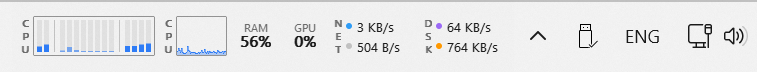

Click a widget for its popup:

| CPU | Network |
|---|---|
| 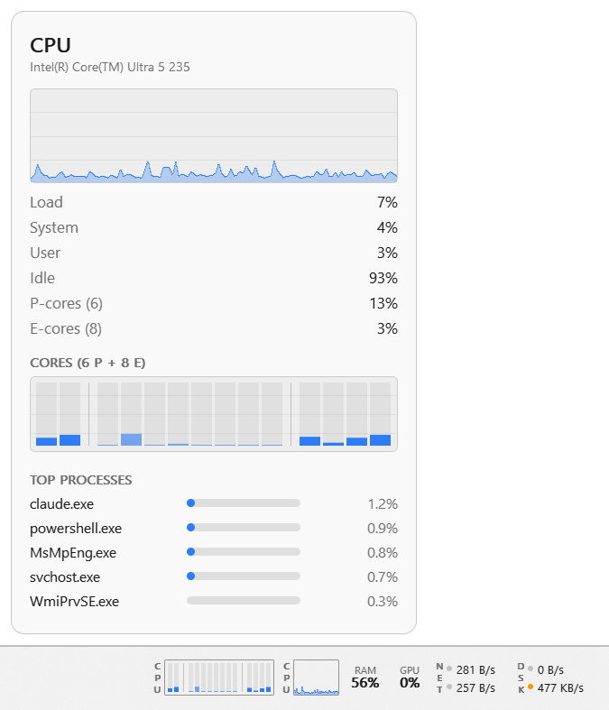 | 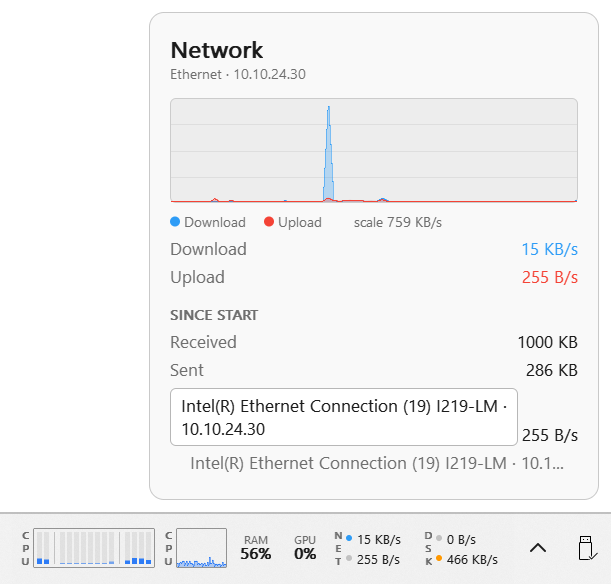 |

| Memory (a pie slice under the mouse) | Disk | GPU |
|---|---|---|
| 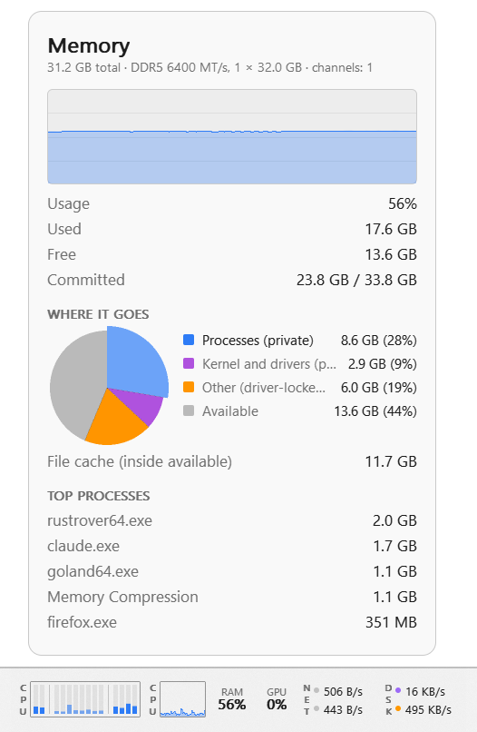 | 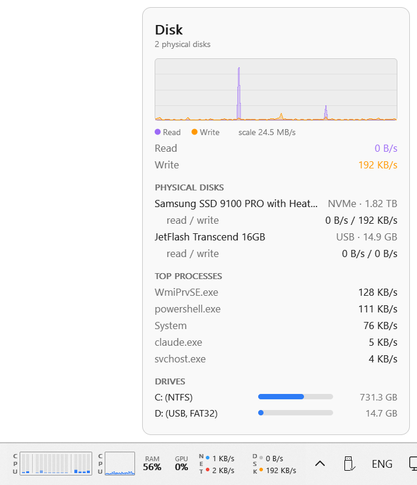 | 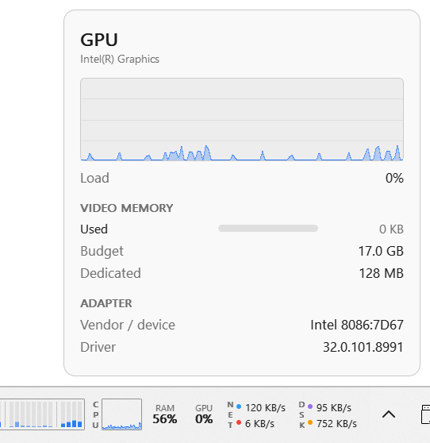 |

The Network popup above shows the tooltip that opens over a label that did not fit.

Right click for the settings menu:

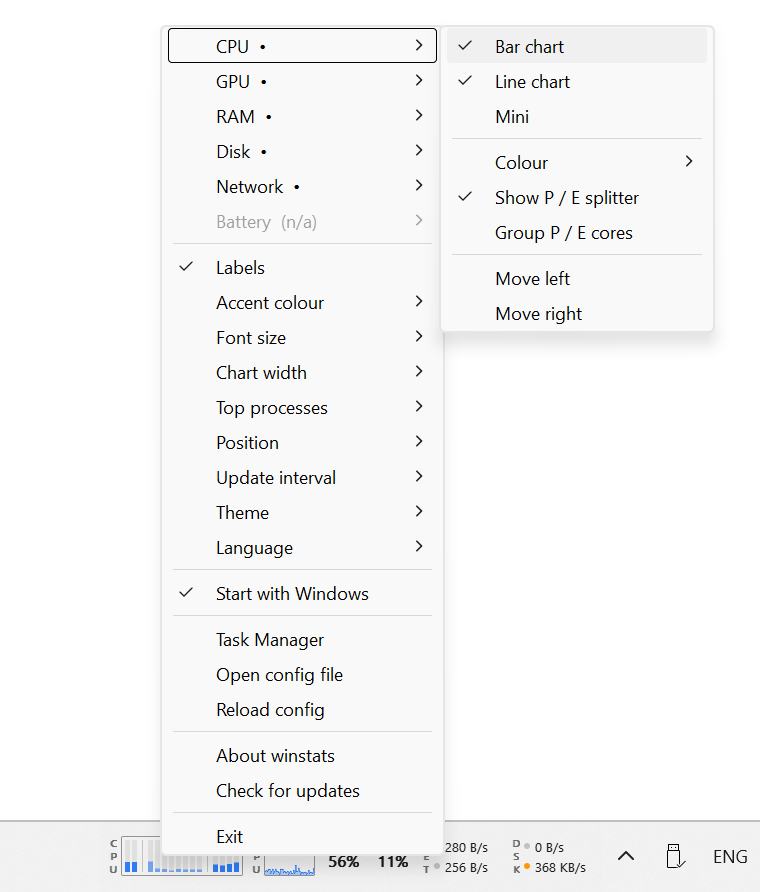

The interface comes in 29 languages (see Configuration); Greek and Ukrainian here:

| CPU popup, Greek | Memory popup, Ukrainian |
|---|---|
| 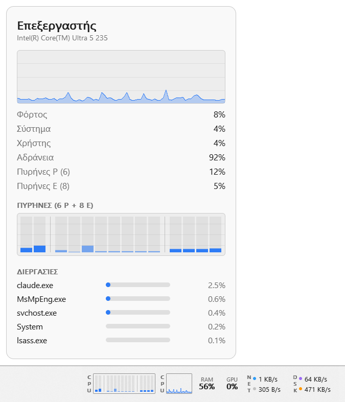 | 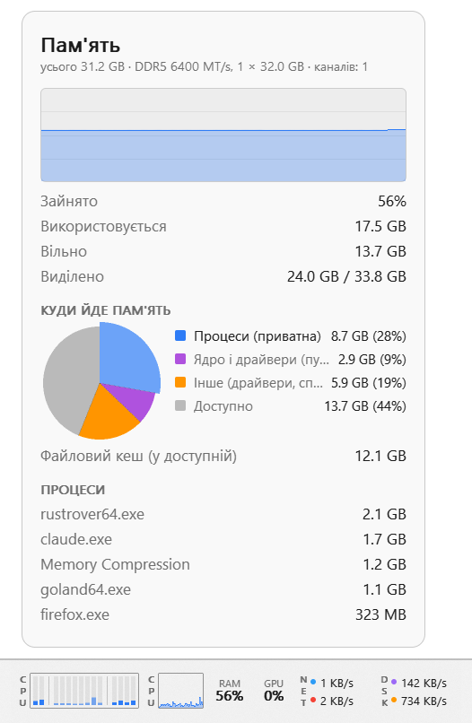 |

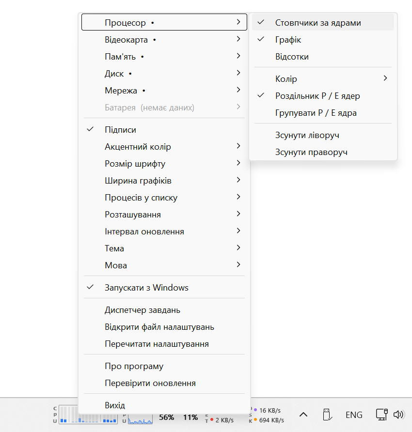

A few other ways to set it up (everything below is picked from the menu or written in the config):

Charts only, no labels, `chart_width = 64`:

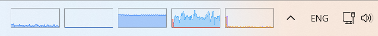

Text widgets with the CPU bars grouped into P / E cores, `font_scale = 1.15`:

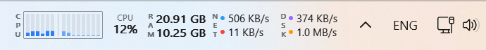

Purple accent, CPU coloured by utilisation, RAM orange, GPU teal, network green, disk pink, `chart_width = 48`:

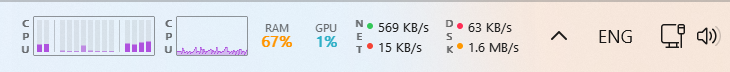

Monochrome: every module set to `mono`, everything in the text colour:

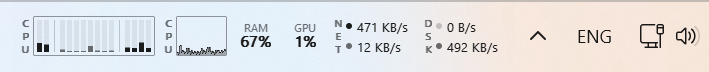

By utilisation: CPU, RAM and GPU set to `utilization`, green accent; values turn yellow, orange and red as load
rises (RAM at 67% is already yellow here):

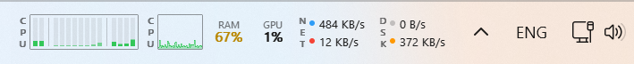

## Download

Grab `winstats.exe` (64-bit) or `winstats-x86.exe` (32-bit) from the
[latest release](https://github.com/mgvs/winstats/releases/latest) and run it. No installer, no runtime, a single
executable. The same page has `winstats-agent` for the other machines you want to watch (see Remote machines).

## Supported systems

| Windows | x64 | x86 | notes |
|---|---|---|---|
| 11 | yes | yes | the strip is a child of the taskbar; the centred task list can run over it when many windows are open, see Limitations |
| 10 | yes | yes | child of the taskbar; the task list is shrunk to make room |
| 8 / 8.1 | yes | yes | same as 10, no GPU load (the counters appeared in Windows 10) |
| 7 SP1 | yes | yes | the strip is an always-on-top window floating over the taskbar (Windows 7 cannot host a layered child); it hides itself while a full-screen Direct3D game or a presentation is in front; no GPU load, no VRAM |

The hosting mode is picked automatically (`mode = "auto"` in the config): floating on Windows 7, embedded elsewhere.
`mode = "floating"` forces the floating window on any version, which is also a way around the Windows 11 task-list
overlap. ARM64 is not built, but nothing in the code is x86-specific.

Both binaries are built with Rust 1.77, the last toolchain that still runs on Windows 7.

## Build and run

```
cargo build --release                                   # x64
cargo build --release --target i686-pc-windows-msvc     # x86
target\release\winstats.exe
```

`rust-toolchain.toml` pins Rust 1.77 and both targets; rustup fetches them on the first build.

The log goes to `%APPDATA%\winstats\winstats.log`.

Controls:

- Left click on a widget opens a details popup (like the popover in Stats):
  - CPU: history chart, load/system/user/idle, the current clock (per core class on hybrid CPUs, from the
    `Processor Information` counters like Task Manager), every core, top processes by CPU;
  - Memory: history chart, used/free/commit, DDR type, speed and channel count from SMBIOS, a pie chart of where the memory goes
    (process private sets, kernel pools, driver-locked/shared, available) with a legend that lights up under the
    mouse, file cache, top processes by memory;
  - GPU: history chart, VRAM used/budget, vendor/device id and driver version, every adapter when there are several;
  - Network: interface and IPv4, receive/transmit chart, totals since start, every physical adapter (Ethernet,
    Wi-Fi with the network it is joined to, mobile, Bluetooth) with its own rate and address; clicking an adapter
    takes it out of (or puts it back into) the widget and the chart, switched-off ones are drawn faded; at least one
    adapter always stays on;
  - Disk: read/write chart, every physical disk with model, bus and per-disk rates (clicking a disk takes it out
    of the widget and the chart, like the network adapters; one disk always stays on), top processes by I/O, every drive (fixed, USB, DVD)
    with its file system and free space; read-only media (DVD) show only their capacity; floppy drives are left
    alone so the popup never spins them up;
  - Battery: level, state, time left, power draw, capacity.
  Labels that do not fit are cut with an ellipsis; hovering one shows the full text.
  Widgets of remote machines (see Remote machines below) open the same popups for that machine.
  Clicking again, Esc or a click anywhere else closes the popup.
- Right click opens a Stats-style settings menu: a submenu per module (CPU, GPU, RAM, Disk, Network, Battery) with a
  checkable entry per widget type and a Colour submenu (Accent / By utilisation / Monochrome / palette: System accent,
  Blue, Green, Red, Orange, Yellow, Purple, Pink, Teal, Cyan, Indigo, White, Black), plus Labels, Accent colour, Font size,
  Chart width, Bar width (of the CPU core bars, the same for every machine), Top processes (5 / 10 / 15 / 20 rows in the
  popup lists), Position, Update interval, Theme, Language.
  Changes apply immediately and are written to the config; the menu stays open after a toggle, so several settings
  can be changed in one visit (a click outside or Esc closes it), and the palette entries show their colour in the
  check column. Below that: Start with Windows
  (autostart through `HKCU\...\CurrentVersion\Run`), Task Manager, Open config file, Reload config, About winstats
  (version, author, links to the repository and the license), Check for updates, Exit. The update check asks the
  GitHub API for the latest release (once, quietly, 20 s after start, and on demand from the menu); when a newer
  version exists the menu entry turns into "Update available: x.y.z" and opens the download page.
- Double click opens Task Manager.
- Reordering: drag a widget along the strip with the left button (a marker shows where it will land), or use
  Move left / Move right in a module's submenu to shift all of that module's widgets as a block. The order is the
  order of names in `widgets` in the config.

Widget types per module:

| module | widgets |
|---|---|
| CPU | `cpu_bars` (one bar per core), `cpu_line` (history), `cpu_mini` (percent) |
| GPU | `gpu` (percent), `gpu_line` (history) |
| RAM | `mem` (percent), `mem_line` (history), `mem_text` (used on top, free below, like the Memory widget in Stats) |
| Disk | `disk` (read/write as numbers), `disk_chart` (chart) |
| Network | `net` (receive/transmit as numbers), `net_chart` (chart) |
| Battery | `battery` |

Modules the machine cannot feed are greyed out in the menu and left out of the widget list on first start: GPU when
the PDH "GPU Engine" counters do not exist, Battery on machines without one.

## Configuration

`%APPDATA%\winstats\config.toml` is created on first start:

```toml
position = "right"      # "right" = next to the system tray, "left" = left edge of the taskbar
offset = 0              # shift from that edge, in DIP
widgets = ["cpu_bars", "cpu_line", "mem", "gpu", "net", "disk", "battery"]
update_ms = 1000
labels = true           # vertical CPU / NET / DSK labels like in Stats
disk = "C:"
accent = "blue"         # palette name, "system" (Windows accent colour) or "#RRGGBB"
theme = "auto"          # auto | dark | light
font_scale = 1.0        # widget text size: 0.85 | 1.0 | 1.15 | 1.3
group_pe_cores = false  # show P-cores first, then E-cores
split_pe_cores = true   # divider between P and E cores
chart_width = 34        # width of chart widgets in DIP: 34 | 48 | 64 | 96 (Chart width in the menu)
bar_width = "small"     # one core bar in the CPU bar chart, the same for every machine: small | medium | large
mode = "auto"           # auto | embedded | floating (see Supported systems)
top_processes = 5       # rows in the popup process lists: 5 | 10 | 15 | 20
language = "auto"       # "auto" = Windows display language, or a code from the list below
net_disabled = []       # network adapters (by name, e.g. "Wi-Fi") left out of the widget and the chart
disks_disabled = []     # physical disks (by model) left out of the widget and the chart
discovery = false       # listen for winstats-agent beacons (Remote machines menu)
share = false           # serve this machine to other winstats on the network

[colors]                # colour per module: accent | utilization | mono | palette name | "#RRGGBB"
cpu = "utilization"
mem = "mono"
```

Colour modes: `accent` draws charts in the accent colour and numbers in the plain text colour; `utilization` goes
green / yellow / orange / red with the value (darker shades on a light taskbar so they stay readable); `mono` draws
everything in the text colour; a palette name colours both charts and numbers. `utilization_colors = true` from older
configs is still understood as `cpu = "utilization"`.

On hybrid Intel CPUs (P/E cores) the CPU bar chart and the popup separate the groups: E-cores are drawn lighter and
split from the P-cores, and the popup has separate P-cores / E-cores load rows. On multi-socket machines the same
divider separates the sockets and the popup shows the socket count. Core classes and packages come from
`GetLogicalProcessorInformationEx` (first processor group, up to 64 logical CPUs). By default cores follow the Windows numbering (on Arrow Lake that interleaves,
e.g. 2 P, 8 E, 4 P, the same order Task Manager shows). "Group P / E cores" in the CPU submenu (`group_pe_cores = true`)
shows all P-cores first, then E-cores; "Show P / E splitter" (`split_pe_cores`) toggles the divider between the groups.

Languages: the menu and the popups are translated into Bulgarian, Chinese (Simplified and Traditional), Czech, Danish,
Dutch, English (US and UK), Estonian, French (France and Canada), German (Germany and Switzerland), Greek, Hungarian,
Italian, Japanese, Latvian, Lithuanian, Norwegian Bokmål, Polish, Portuguese, Romanian, Russian, Serbian, Spanish,
Swedish, Turkish and Ukrainian. The codes for `language` are the file names in `locales/`; every locale is embedded
in the executable, nothing ships beside it. Strings missing from a locale fall back to English.

Text is rendered by GDI with CLEARTYPE_QUALITY and the RGB coverage is averaged: Segoe UI's gasp table disables
grayscale antialiasing at small sizes, so with ANTIALIASED_QUALITY the small text came out jagged.

Data sources:

| widget | shows | source |
|---|---|---|
| `cpu_bars` | one bar per logical core | `NtQuerySystemInformation(SystemProcessorPerformanceInformation)` |
| `cpu_line` | total CPU load history | same |
| `mem` | used memory in % | `GlobalMemoryStatusEx` |
| `gpu` | GPU load as in Task Manager | PDH `\GPU Engine(*)\Utilization Percentage` |
| `net` | receive/transmit rate over physical adapters | `GetIfTable2` |
| `disk` | read/write over all physical disks | PDH `\PhysicalDisk(_Total)` |
| `battery` | charge and state; hidden without a battery | `GetSystemPowerStatus` |

Popup data: processes through `NtQuerySystemInformation(SystemProcessInformation)`, GPU adapters, VRAM and driver
version through DXGI, memory modules from the SMBIOS table (`GetSystemFirmwareTable`), physical disk models through
`IOCTL_STORAGE_QUERY_PROPERTY` with per-disk PDH rates, the interface IP through `GetAdaptersAddresses`, drives through
`GetLogicalDrives` + `GetVolumeInformationW`, adapters through `GetIfTable2` with Wi-Fi names from `wlanapi`, battery through `CallNtPowerInformation(SystemBatteryState)`. The
changing ones are collected only while the popup is open.

## Remote machines

Other machines on the network can show up in the same strip: a Linux box, a Mac, another Windows PC. Each of them
runs `winstats-agent` (or, on Windows, winstats itself with sharing on); winstats on your desk finds them, connects,
and draws their widgets next to the local ones with their own colours and a label of their own.

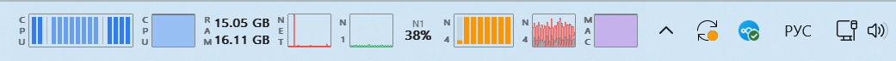

| A remote machine's popup | The Remote machines menu |
|---|---|
| 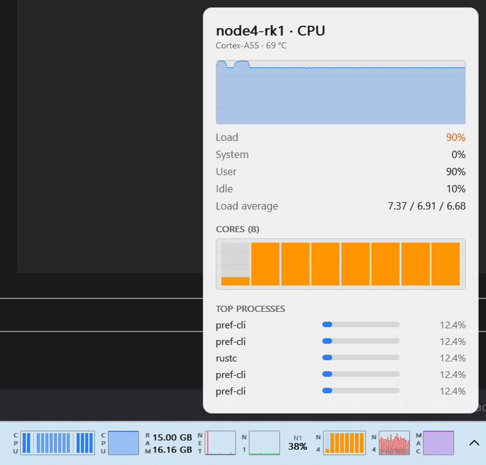 | 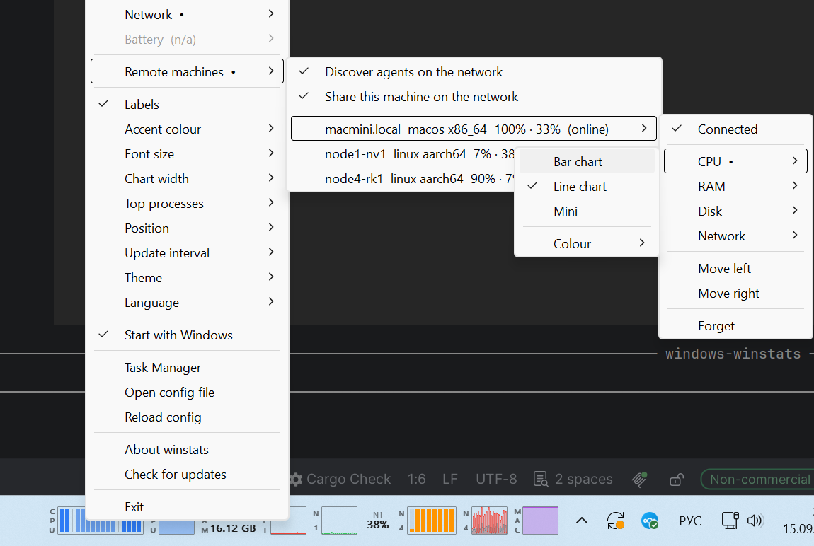 |

How it fits together:

- **Discovery.** Agents announce themselves with a small UDP beacon (multicast `239.255.77.77:47777`, plus a
  broadcast on each of their subnets) every 2 seconds. Nothing is listened for until you turn on *Remote machines >
  Discover agents on the network*; with discovery off winstats does not touch the network, except for machines it
  already knows.
- **Data.** For every machine you connect, winstats opens one TCP connection (port 47778) and receives a snapshot per
  second: CPU total and per core, memory, per-interface and per-disk rates, temperatures, load average, GPU and battery
  where the agent has them. Popups ask for the process list and the drives only while open.
- **Identity.** A machine is remembered by the id its agent generated on first start, not by its name or address, so
  a renamed or re-addressed box picks up its widgets, its place in the strip and its colours when it reappears.
  When a machine stops answering its widgets keep their last values, turn grey after 10 seconds and leave the strip
  after 30 seconds; the order is kept and they come back with the first new data.

### Setting it up

1. Run `winstats-agent` on the other machine (see below).
2. Right click the strip, *Remote machines*, tick *Discover agents on the network*. The machines heard appear in the
   same submenu with their OS, architecture and current load; open one and choose *Connect*.
3. The machine gets a submenu like a local module: CPU / RAM / Disk / Network with the widget types, a Colour submenu
   per module, Show P / E splitter and Group P / E cores when the machine has two kinds of cores, Labels, Move left /
   right (the whole machine moves as a block), and Forget. It starts with a CPU history and a memory percentage.
4. Click a remote widget for its popup: the same layout as the local ones, with the machine's name in the title,
   the CPU temperature and the load average when the agent reports them, and the process list from that machine.

The vertical label next to a remote widget is the machine's `label` (three letters, derived from its name; edit it
in the config). Toggling interfaces and disks in the popups works the same way and is stored per machine.

### The agent

`winstats-agent` is one binary per platform; the [latest release](https://github.com/mgvs/winstats/releases/latest)
ships it for Linux x86-64 and ARM64 (static, any distribution), macOS on Intel and Windows; other targets build from
source with `cargo build --release -p winstats-agent` (Rust 1.77 or newer). It needs no configuration:

```
winstats-agent                    # run in the foreground (beacons + data on port 47778)
winstats-agent --dump             # print what it would report and exit
winstats-agent discover           # list the agents it hears on the network
winstats-agent watch 10.0.0.5     # connect to an agent and print its frames
winstats-agent install-service    # start at boot; uninstall-service removes it
```

`install-service` writes a systemd unit on Linux (a system service when run with `sudo`, else a user service plus
`loginctl enable-linger`), a LaunchAgent on macOS and a Run key on Windows. The config, `agent.toml`, lives in
`~/.config/winstats-agent/` (`%APPDATA%\winstats-agent\` on Windows) and holds the generated `id`, an optional
`name`, `port`, `interval_ms`, `token` and `multicast`. Options on the command line override it.

A Windows machine that runs winstats needs no agent: *Remote machines > Share this machine on the network* makes
winstats announce and serve itself (`share`, `share_name`, `share_port`, `share_token` in the config).

### Firewall and network notes

- Windows Firewall asks once when discovery or sharing starts; the auto-created rule is "block" if the prompt is
  dismissed, so allow `winstats.exe` in *Windows Defender Firewall > Allow an app* if nothing is found. The agent
  needs `47777/udp` (beacons, only when it discovers) and `47778/tcp` (data) open on its machine.
- Multicast and broadcast do not cross VLANs or VPNs. For such machines put the address in the config
  (`address = "10.8.0.5:47778"` under `[remotes.<key>]`); discovery is not needed for them.
- A `token` on the agent must match `token` in the machine's `[remotes.<key>]` section (and `share_token` for a
  sharing winstats); it keeps casual neighbours out, it is not encryption.

Config of a remote machine:

```toml
discovery = true
share = false

[remotes.node1]                # the key is what widgets refer to: "node1/cpu_line"
id = "b1021d5675c00168affa11ca3bf541b2"
name = "node1-nv1"
address = "10.10.24.81:47778"  # learned from the beacon, or typed in
enabled = true
label = "N1"
token = ""
net_disabled = []
disks_disabled = []

[remotes.node1.colors]         # same modes as [colors]
cpu = "green"
```

## Limitations

- Vertical taskbars are not supported.
- Second monitor: the strip only lives on the primary taskbar.
- Windows 11: the centred task list is XAML and cannot be shrunk, so with many open windows it runs over the strip.
  Workarounds: `position = "left"` (the area left of a centred list is usually free) or `mode = "floating"`.
- No temperatures or fan speeds: reading them needs a kernel driver, which winstats does not ship.

## Author and license

Oleksandr Zhabotynskyi <alexlp@mgvs.org>. MIT. The look follows [Stats](https://github.com/exelban/stats) (MIT);
no code from it is used.
